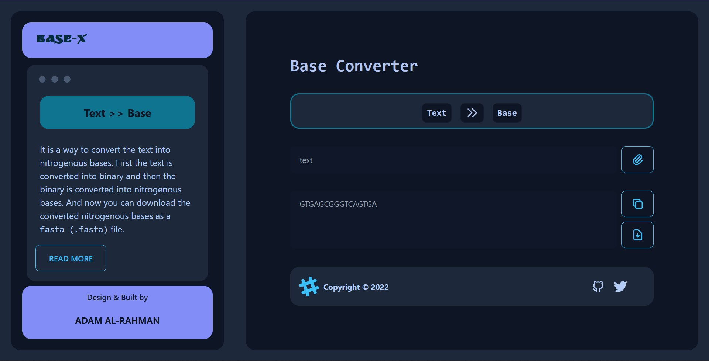

  

<h1 align="center">
Base-X
</h1>

The converter that convert text into nitrogenous bases.

  This text converter is built with <a href="https://nextjs.org/" target="_blank">Next.js</a> and hosted with <a href="https://www.netlify.com/" target="_blank">Netlify</a>

  upcoming the netlify status image

## Algorithms

It use the simple algorithm to convert the `text` into `base` as follows

## Todo

- [ ] Apply `Goldman encoding` & `Huffman encoding` method.
- [ ] Convert `Base` >> `Text`.
