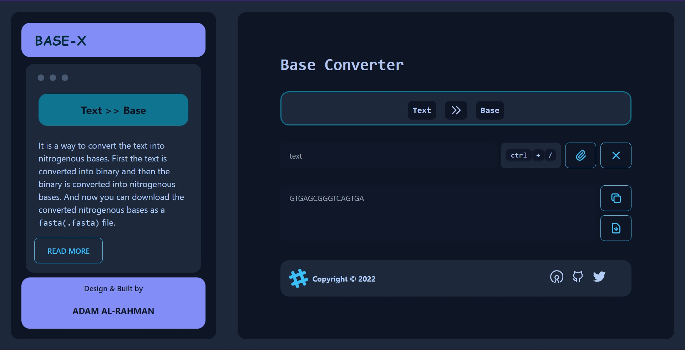

<div align="center">
  
</div>
<h1 align="center">
Base-X
</h1>
<p align="center">The converter that convert text into nitrogenous bases.</p>
<p align="center">
  This text converter is built with <a href="https://nextjs.org/" target="_blank">Next.js</a> and hosted with <a href="https://www.netlify.com/" target="_blank">Netlify</a>
</p>

<p align="center">
  <a href="https://app.netlify.com/sites/atiq-ur-rehaman/deploys" target="_blank">
    
  </a>
</p>



## Algorithms

It use the simple algorithm to convert the `text` into `base` as follows

```ts
/**
- First the text is converted into binary.
- Then the binary is converted into string.
- After that the binary string is converted into the nitrogenous bases using the following object(in python dict).
*/
const dnaEncoding = {
  '00': 'A', // adenine
  '01': 'G', // guanine
  '10': 'C', // cytosine
  '11': 'T', // thymine
}
```

## Todo

- [ ] Apply `Goldman encoding` & `Huffman encoding` method.
- [ ] Convert `Base` >> `Text`.
- [ ] 404 Page.

## Tools || Libraries used to build the site

- TypeScript (Languages)
- DaisyUi (UI components)
- Next.js (Frontend)
- TailwindCss (for styling)
- Netlify (Deploying)

---

<div align="center">
  <a href="https://atiq-ur-rehaman.netlify.app"  target="_blank"> </a>
  <p  >Made by <a href="https://atiq-ur-rehaman.netlify.app"  target="_blank">Adam Al-Rahman</a>.</p>
</div>
